# Molecular Dynamics Simulation of Melting in a Lennard-Jones Crystal

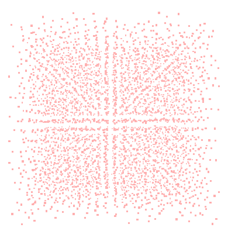
*A VMD snapshot capturing the coexistence of solid (ordered) and liquid (disordered) phases during the melting transition of the FCC crystal.*

---

## 📖 Table of Contents

-   [1. Project Overview](#1-project-overview)
-   [2. Scientific Background](#2-scientific-background)
-   [3. Simulation Methodology](#3-simulation-methodology)
-   [4. Results: Signatures of a Phase Transition](#4-results-signatures-of-a-phase-transition)
    -   [Thermodynamic Properties](#thermodynamic-properties)
    -   [Structural Analysis: g(r)](#structural-analysis-gr)
    -   [Dynamical Analysis: MSD](#dynamical-analysis-msd)
-   [5. Discussion: Superheating and Kinetic Effects](#5-discussion-superheating-and-kinetic-effects)
-   [6. How to Reproduce This Study](#6-how-to-reproduce-this-study)
-   [7. Technologies Used](#7-technologies-used)

---

## 1. Project Overview

This project investigates the melting of a Lennard-Jones (LJ) crystal with a face-centered cubic (FCC) structure using molecular dynamics (MD) simulations. The primary goal is to characterize the solid-to-liquid first-order phase transition by monitoring a suite of thermodynamic, structural, and dynamical observables.

A key aspect of this work is the investigation of **kinetic effects**, such as **superheating**, which cause the observed melting temperature in a simulation to be higher than the true thermodynamic value. We demonstrate and quantify this effect by performing simulations at different heating rates and analyzing the resulting hysteresis cycle.

This repository contains the LAMMPS input scripts, MATLAB analysis scripts, and a detailed summary of the findings.

---

## 2. Scientific Background

Melting is a fundamental phase transition where a substance transitions from an ordered solid to a disordered liquid. We model the interactions between neutral atoms using the classic **Lennard-Jones (LJ) potential**:
$$V_{LJ}(r) = 4\epsilon\left[\left(\frac{\sigma}{r}\right)^{12} - \left(\frac{\sigma}{r}\right)^6\right]$$
Despite its simplicity, the LJ model captures the essential physics of phase transitions in simple substances and serves as a canonical system in computational physics. Our simulation aims to reproduce its melting behavior and explore the nuances of computationally-driven phase transitions.

---

## 3. Simulation Methodology

The MD simulations were performed using the **LAMMPS** package.

-   **System Setup:** An FCC crystal of **N=4000** atoms was created. The simulation was run in LJ units with periodic boundary conditions in all three dimensions to mimic a bulk system.
-   **Ensemble and Protocol:** We used an **NPT ensemble** at zero pressure ($P^*=0$). The simulation protocol consisted of an initial equilibration, a linear heating ramp, and a final equilibration in the liquid state.
-   **Equilibration:** The system was first equilibrated at $T^*=0.3$. The stability was confirmed by monitoring energy and temperature, which stabilized after ~15,000 steps.

| Energy during Equilibration                                     | Temperature during Equilibration                                     |
| --------------------------------------------------------------- | -------------------------------------------------------------------- |
| 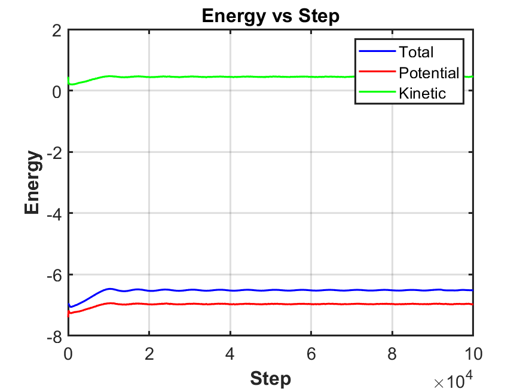 | 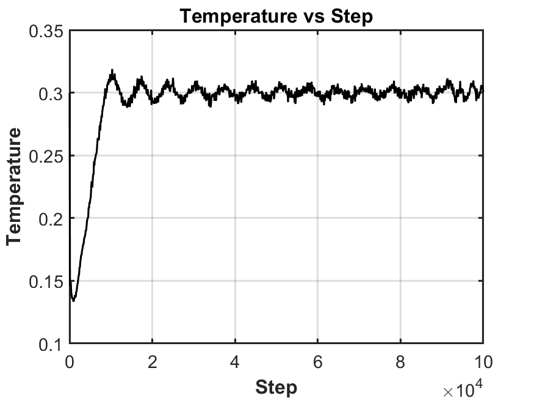 |

-   **Timestep Stability:** The choice of timestep ($\Delta t = 0.005\tau$) was validated by observing stable energy fluctuations around a mean value during the NPT run, confirming the stability of the Nosé-Hoover integrator.

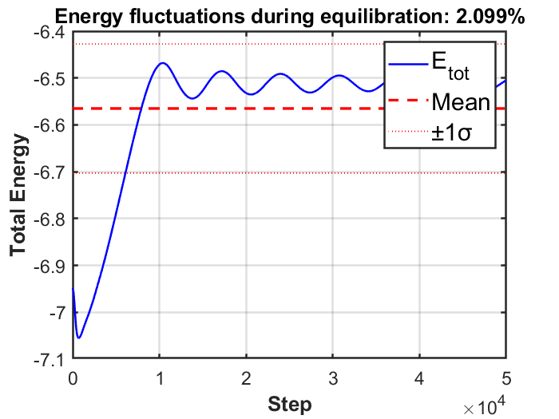

A qualitative overview of the process is shown in the VMD snapshots below, capturing the system's transition from an ordered solid to a disordered liquid.

| Solid Phase ($T^*=0.3$)           | Melting Phase ($T^* \approx 0.8$)   | Liquid Phase ($T^*=2.0$)           |
| ---------------------------------- | ----------------------------------- | ---------------------------------- |
| 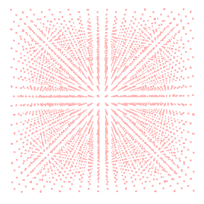 |  | 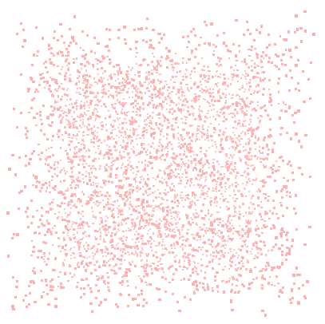 |

---

## 4. Results: Signatures of a Phase Transition

We analyzed several key observables to pinpoint the melting transition, which consistently appeared around **$T_{obs}^* \approx 0.8$**.

### Thermodynamic Properties

The total energy, density, and temperature plots clearly show the signatures of a first-order phase transition.
-   The **energy-temperature curve** exhibits a "kink" corresponding to the absorption of latent heat.
-   The **temperature-time curve** shows a plateau during the heating ramp, as the input energy is used to break crystal bonds instead of increasing kinetic energy.
-   The **density** shows a sharp drop as the crystal expands into a liquid, with large fluctuations at the transition point.

| Energy vs. Temperature                                    | Density vs. Temperature                                 |
| --------------------------------------------------------- | ------------------------------------------------------- |
| 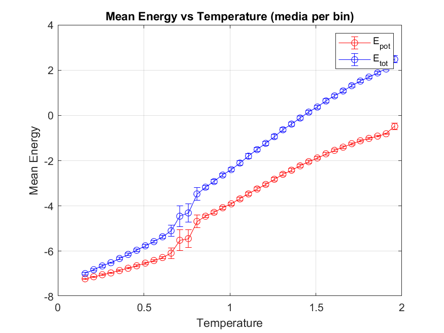 | 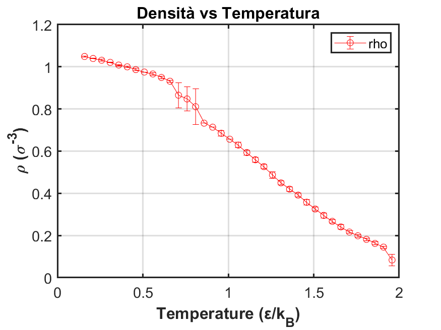 |

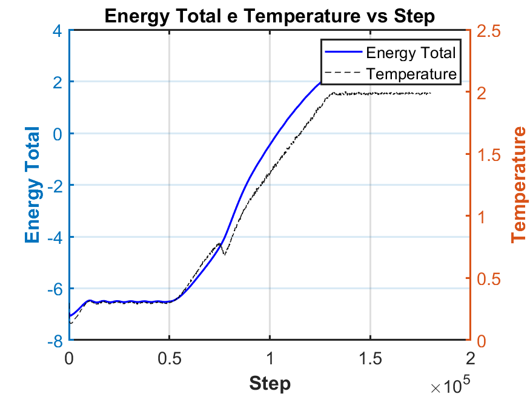

### Structural Analysis: g(r)

The **Radial Pair Distribution Function, $g(r)$**, provides a fingerprint of the system's structure. The plots below show its evolution from a function with sharp peaks (long-range order in the solid) to one with only broad, decaying peaks (short-range order in the liquid).

**Solid Phase ($T^*=0.3$):**
_solid.png)

**Melting Phase ($T^* \approx 0.8$):**
_melting.png)

**Liquid Phase ($T^*=2.0$):**
_liquid.png)

### Dynamical Analysis: MSD

The **Mean Square Displacement (MSD)** distinguishes between the solid and liquid states based on atomic mobility. The MSD remains near zero in the solid phase (atoms vibrate around lattice sites) and grows linearly in the liquid phase (atoms diffuse freely). The plot shows an explosive growth in MSD, confirming the transition to a diffusive liquid state.

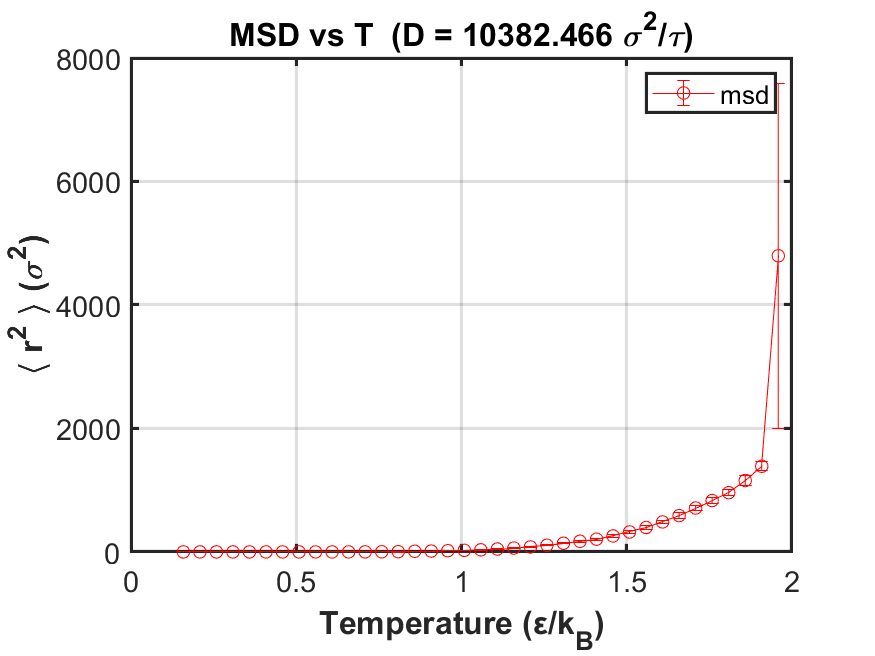
*The MSD shows a sharp increase at higher temperatures, indicating the onset of diffusive atomic motion.*

---

## 5. Discussion: Superheating and Kinetic Effects

The observed melting temperature of $T_{obs}^* \approx 0.8$ is significantly higher than the accepted thermodynamic melting point of the LJ solid ($T_m^{\text{lit}} \approx 0.69$). This discrepancy is due to **superheating**, a kinetic artifact where the system remains in a metastable solid state above its true melting point because the heating rate is too fast for the liquid phase to nucleate.

We confirmed this by:
1.  **Varying the Heating Rate:** Simulations with slower heating rates showed a lower melting temperature, demonstrating the rate-dependence of the observed transition. The true thermodynamic melting point is the value extrapolated to a zero heating rate.
2.  **Hysteresis Cycle:** A full heating-and-cooling cycle revealed a clear hysteresis loop. The system melts at a higher temperature than it freezes, and upon cooling, it becomes a disordered glass rather than recrystallizing. This is a classic hallmark of a kinetically-limited first-order transition.

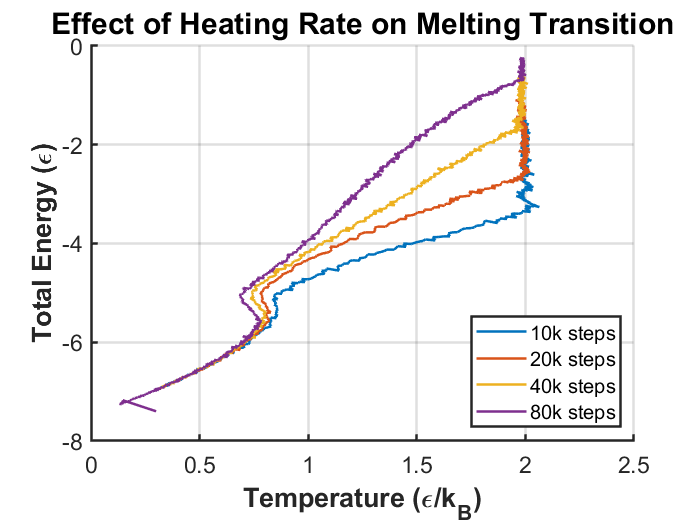
*As the heating rate decreases (longer simulation time), the observed melting point shifts to lower temperatures, approaching the true thermodynamic value.*

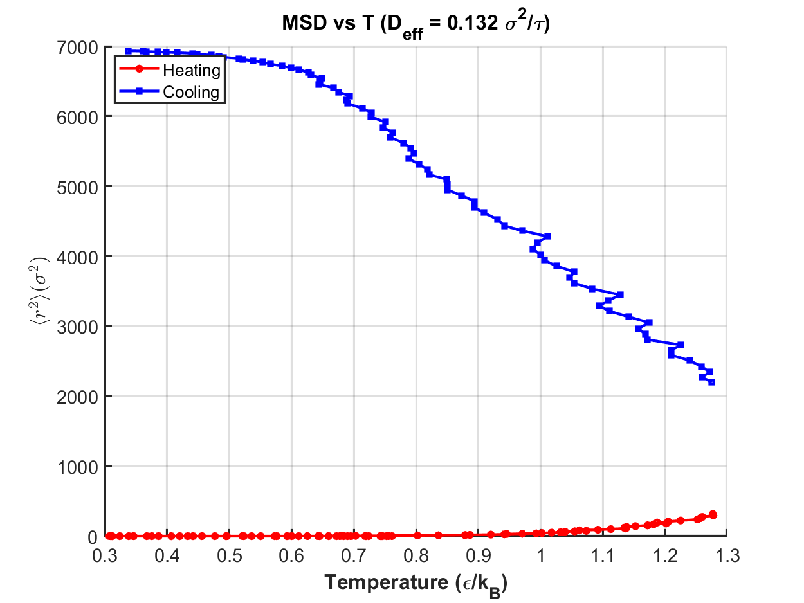
*MSD during the hysteresis cycle, showing diffusive behavior on heating and dynamical arrest on cooling.*

---

## 6. How to Reproduce This Study

### Prerequisites
-   A working installation of [LAMMPS](https://www.lammps.org/).
-   MATLAB for data analysis and plotting.

### Steps
1.  **Run the Simulation:** The primary simulation can be run using the main LAMMPS input script.
    ```bash
    lmp -in in.melt
    ```
    (Replace `in.melt` with the actual name of your input script). This will generate log files and dump files containing the simulation data.

2.  **Analyze the Data:** Use the provided MATLAB scripts to process the output from LAMMPS.
    ```matlab
    % In MATLAB, run the main analysis script
    >> analyze_melting_data
    ```
    (Replace `analyze_melting_data` with the name of your MATLAB script). This will generate the plots and data tables presented in this study.

---

## 7. Technologies Used

-   **Simulation Engine:** [LAMMPS (Large-scale Atomic/Molecular Massively Parallel Simulator)](https://lammps.sandia.gov/)
-   **Visualization:** [VMD (Visual Molecular Dynamics)](https://www.ks.uiuc.edu/Research/vmd/)
-   **Data Analysis & Plotting:** [MATLAB](https://www.mathworks.com/products/matlab.html)
-   **Documentation:** LaTeX
